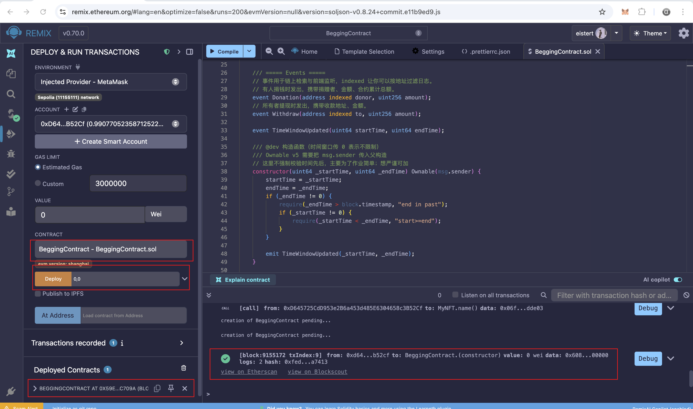
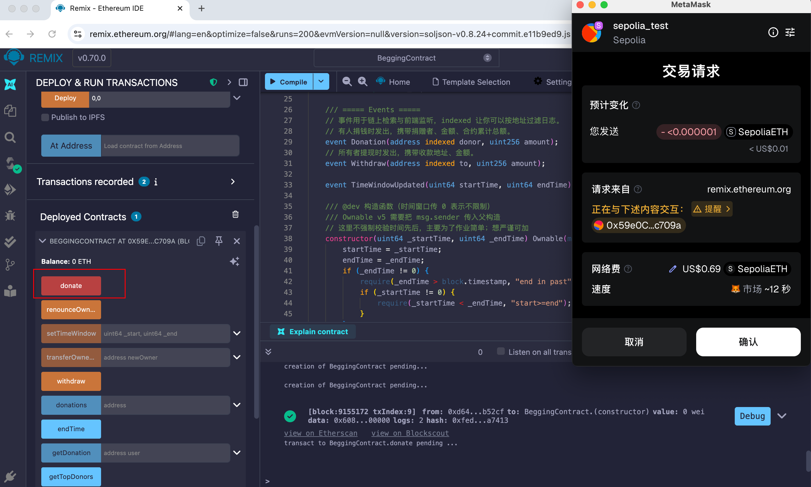
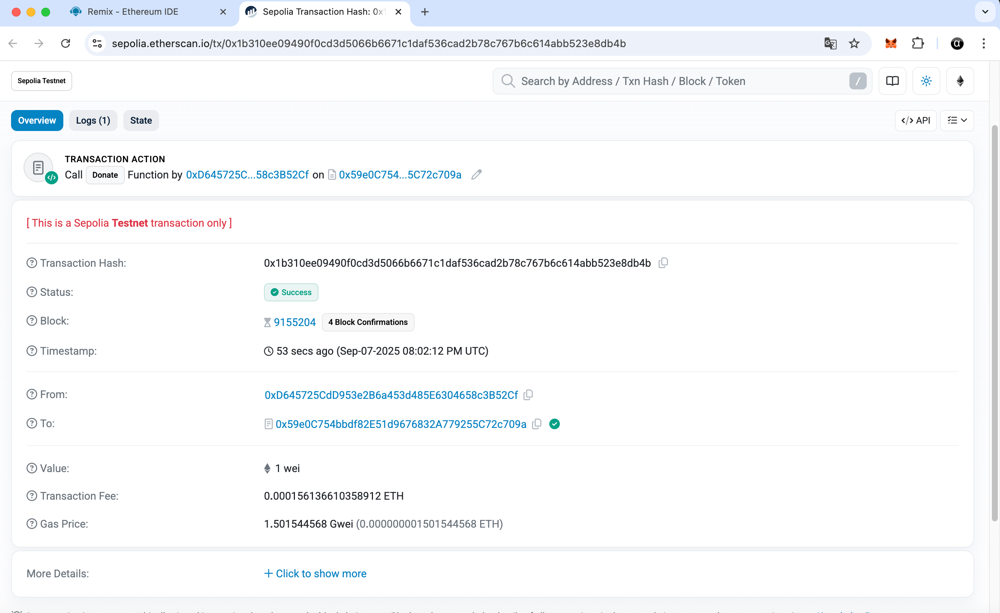
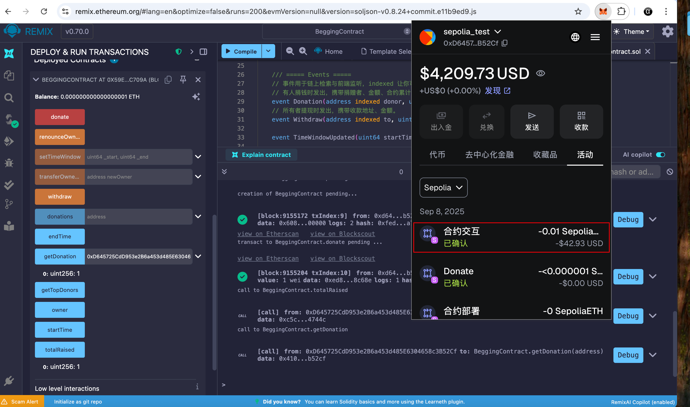
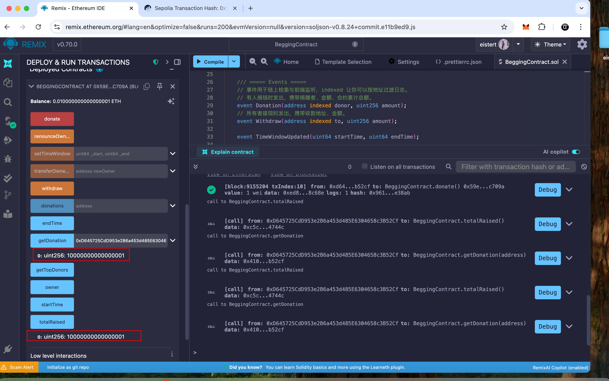
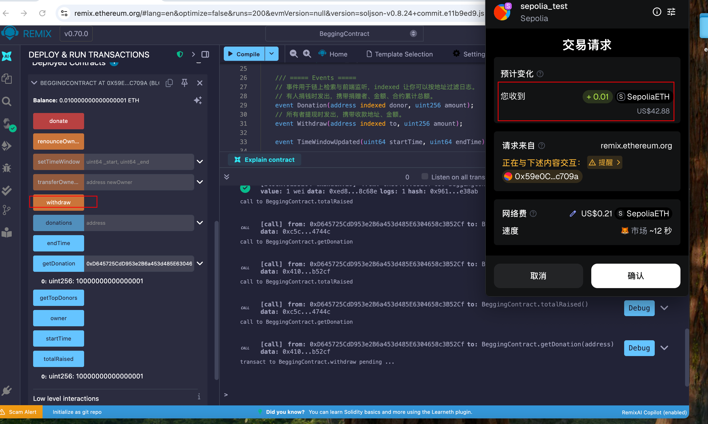

## 合约部署成功截图

## 合约地址：

0x59e0C754bbdf82E51d9676832A779255C72c709a

https://sepolia.etherscan.io/tx/0x1b310ee09490f0cd3d5066b6671c1daf536cad2b78c767b6c614abb523e8db4b

## donate

## 打开 MetaMask，向合约地址直接发送 0.021ETH

交易成功后，再回 Remix：

点 totalRaised()，应增加了 0.01 ETH；
点 getDonation(你的地址)，也会随之累加；
在 Etherscan 的该交易页里同样能看到 Donation 事件。

## 仅 owner 能提现（withdraw）

1、切回部署者账号（owner）。展开合约实例，点击 withdraw()。

2、交易成功后：

- Etherscan 上你会看到一笔从合约地址转到 owner 的转账（数额等于合约余额）。

- 在 Remix 里点 totalRaised() 仍保持为累计捐款（这是历史总额，不会清零）；
但合约的 余额 为 0（余额可以在 Etherscan 合约页查看，或用 etherscan 查看账户余额）。

3、切换到非 owner账号，再点 withdraw()，应 revert（Remix 控制台会红字报错）。

